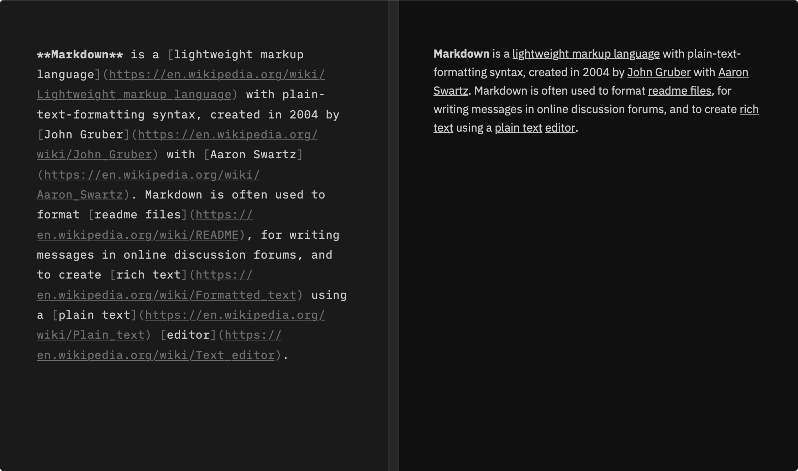

[Markdown](https://en.wikipedia.org/wiki/Markdown) makes writing for the web simple. It allows me to write and format in plain text, then, when I'm ready, publish by pushing to [GitHub](https://github.com/tmm/www). In theory, I could write an entire post without ever looking at the preview — let alone the generated HTML. Instead, my workflow looks something like this:

1. Write in Vim.
2. Preview in Firefox.
3. Switch back to Vim for revisions.
4. Repeat until done.
5. Commit and push changes.

Since I care a lot about how my writing looks (paragraph size, word wrap, etc.), I do a lot of switching between Vim and Firefox. After every switch, I need find my cursor or the line I was reading again.

It's tiring to switch back and forth so I decided to explore making my own editor based on the [GitHub Flavored Markdown Spec](https://github.github.com/gfm). There are a few features outside of the editor that are important, but don't matter until I can write and preview.

With that in mind, I did a bunch of research. I downloaded and tested an absurd number of editors. I didn't use any metrics to compare other than how it *felt* to write in them. Often, how it felt depended on how an editor treated Markdown.

Markdown is difficult to work with because there isn't a [formal grammar](https://roopc.net/posts/2014/markdown-cfg/) so developers need to decide on guardrails for processing it. Before I detail my guardrails, it's worth walking through a couple issues I have with existing Markdown editors.

We'll use the first part of the [Markdown Wikipedia article](https://en.wikipedia.org/wiki/Markdown) as a test example.


<details>
  <summary>Toggle to view example</summary>

```markdown
# Markdown

**Markdown** is a [lightweight markup language](https://en.wikipedia.org/wiki/Lightweight_markup_language) with plain-text-formatting syntax, created in 2004 by [John Gruber](https://en.wikipedia.org/wiki/John_Gruber) with [Aaron Swartz](https://en.wikipedia.org/wiki/Aaron_Swartz). Markdown is often used to format [readme files](https://en.wikipedia.org/wiki/README), for writing messages in online discussion forums, and to create [rich text](https://en.wikipedia.org/wiki/Formatted_text) using a [plain text](https://en.wikipedia.org/wiki/Plain_text) [editor](https://en.wikipedia.org/wiki/Text_editor).

Since the initial description of Markdown contained ambiguities and unanswered questions, the implementations that appeared over the years have subtle differences and many come with syntax extensions.
```
</details>

#### Too much information

[iA Writer](https://ia.net/writer) is the benchmark of Markdown editors. Among other features, it renders previews inline as you type (\*emphasis\* becomes _\*emphasis\*_) and has an optional preview pane for viewing the document's HTML view. In fact, most editors have these exact two features.

We can refer to this type of editor as a "split pane editor" because it divides the window into two panes. Often, the left pane is a [source code editor](https://en.wikipedia.org/wiki/Source-code_editor) with a monospaced font, syntax highlighting, autocomplete, etc. while the right pane is a markup previewer for the compiled HTML.



Notice how the compiled text is much shorter than the plain text version. How content is duplicated across panes. How the preview takes up half the screen. We've basically taken a basic browser and stitched it up next to the editor.

This isn't much better than switching between Vim and Firefox. Looking side-to-side between panes still requires searching for the cursor or reading spot. Sure, overhead is reduced slightly, but it's still there.

Now, let's focus on the editor pane. Notice how the text is a lighter color and syntax is a darker color. Reading the paragraph becomes challenging since the syntax creates dead space between words. Your eyes are forced to do extra work while scanning to distinguish text from syntax.

We are stuck in a catch-22: When reading, syntax is unnecessary, yet when writing, syntax is required for formatting text. By separating reading and writing into different modes, split pane editors erect a wall in the middle of the often dynamic reading-writing process.

#### Nonatomic preview

[Roam Research](https://roamresearch.com) is a modern take on [Org-mode](https://en.wikipedia.org/wiki/Org-mode) that does something rather clever. It moves previews into the document on a [block](https://daringfireball.net/projects/markdown/syntax#block)-by-block basis. When editing, you manipulate plain text in a `textarea`. Then, when focus is lost, the plain text is compiled into a preview inside a `div`.

Although this is an improvement over split-pane editors (you don't need to look elsewhere for the preview), previews aren't real-time and can cause significant text reflowing when focus is toggled, making it difficult to perform an initial selection or maintain focus.

<Figure caption="Roam Research with custom theme">
    <video autoplay loop playsinline>
      <source src="./assets/roam.mp4" type="video/mp4" />
      <p>Your browser doesn't support HTML5 video. Here is
         a <a href="./assets/roam.mp4">link to the video</a> instead.</p>
    </video>
</Figure>

The challenge with block preview editors, like Roam, is previews are scoped too broad. In the example paragraph, there are multiple [inline elements](https://daringfireball.net/projects/markdown/syntax#span) that are independent from each other, yet all of them depend on the containing paragraph's state for triggering previews.

For example, after a link is added to the document, it should just render its preview. It shouldn't have to wait for any other text input or events.

While block-level previews might make programming easier, they make writing more difficult. When previews are scoped to atomic pieces of markup, they render in real time and cause minimal impact to the document layout.

***

How can we design an editor to fix these two problems and break the wall between reading and writing?

iA Writer's less prominent syntax helps maintain focus on text, but creates dead visual space. Roam's block preview solves the issue of showing too much information when reading, but disturbs the layout when writing. Both challenges contain the seeds of a better idea.

Syntax should show up when you need it to and disappear when you don't. Kind of like this:

<Figure caption={
    <div>Demo editor built with TypeScript and <a
        href="https://prosemirror.net"
        target="_blank"
        rel="nofollow noopener noreferrer">ProseMirror</a></div>
}>
    <video autoplay loop playsinline>
      <source src="./assets/mizaru.mp4" type="video/mp4" />
      <p>Your browser doesn't support HTML5 video. Here is
         a <a href="./assets/mizaru.mp4">link to the video</a> instead.</p>
    </video>
</Figure>

In the video, I'm typing up the example text using a no-frills editor I hacked up to experiment with [building my own notes app](https://futureland.tv/tmm/mizaru). The editor scopes previews to individual units of valid markdown. It doesn't care if it's a block heading, strong emphasis, link, etc.

As I type and move around the editor, previews occur in real time and syntax surfaces based on the cursor/selection. In the same document, I can **write in plain text and read in rich text** without specifying a [mode](https://en.wikipedia.org/wiki/Mode_(user_interface)) or doing much of anything! It just works.

The implementation is rather simple. First, I check if the cursor or the selection contains a Markdown element. If it does, I add a CSS class to the container element to show the syntax inside. Once the cursor no longer contains the element, the class is removed and the syntax disappears.

For the real-time previews, I parse the document whenever text changes and check if there are any elements created or removed. If so, I dispatch transactions until the document reflects the [parsed Markdown syntax tree](https://en.wikipedia.org/wiki/Abstract_syntax_tree). There are some other optimizations along the way, like only parsing parts of the document, but it's mostly straightforward.[^1]

While the concept of reading in rich text and writing in plain text solves challenges faced by other Markdown editors, it's not perfect. I haven't figured out how to handle blank lines. Blank lines make sense when typing in plain text (just press <kbd>Enter</kbd>), but don't translate well to HTML previews since Markdown collapses whitespace during compilation.

At some point, I might share more about the Markdown editor and notes app I'm building for myself. In the meantime, [Typora](https://typora.io) and [HyperMD](https://github.com/laobubu/HyperMD) are two alternative editors to check out.[^2]

***

Thanks to [Justin Seymour](https://justin-seymour.com) and [Kent de Bruin](https://www.kentdebruin.com) for reading drafts of this.


[^1]: [ProseMirror](https://prosemirror.net) does all the heavy lifting.

[^2]: HyperMD is the closest to what I'm building, but unfortunately, it's not maintained and it uses [CodeMirror](https://codemirror.net), which is going through a [break-change rewrite](https://codemirror.net/6).

    Also, a co-founder of [Obsidian](https://obsidian.md) [asked on the CodeMirror forum](https://discuss.codemirror.net/t/implementing-wysiwyg-markdown-editor-in-codemirror/2403) how they could do something similar to HyperMD and were directed to use [ProseMirror](https://prosemirror.net/) instead.
